# 📱 Integração de Chat - Student App ↔️ Teacher Dashboard

## Visão Geral

Este documento descreve como o **Dashboard de Professores (projeto externo)** pode integrar-se ao sistema de chat do **Student App** usando Supabase Realtime.

## Estrutura de Dados

### Tabela: `conversations`

Armazena as conversas entre professor e aluno.

```typescript
{
  id: string;              // Formato: "{teacher_id}-{student_id}"
  student_id: string;      // UUID do aluno
  teacher_id: string;      // UUID do professor
  last_message: string;    // Última mensagem enviada
  last_message_at: string; // Timestamp ISO da última mensagem
  unread_count_student: number;  // Mensagens não lidas pelo aluno
  unread_count_teacher: number;  // Mensagens não lidas pelo professor
  is_active: boolean;      // Se a conversa está ativa
  created_at: string;
  updated_at: string;
}
```

### Tabela: `chat_messages`

Armazena as mensagens individuais de cada conversa.

```typescript
{
  id: string;              // UUID auto-gerado
  conversation_id: string; // ID da conversa
  sender_id: string;       // UUID de quem enviou
  sender_type: string;     // "teacher" ou "student"
  message: string;         // Conteúdo da mensagem
  message_type: string;    // "text", "image", "file", etc.
  is_read: boolean;        // Se foi lida
  read_at: string | null;  // Timestamp de leitura
  delivered_at: string | null;  // Timestamp de entrega
  attachments: Json | null; // Anexos (opcional)
  reply_to: string | null;  // ID da mensagem respondida
  created_at: string;
}
```

## Como Integrar no Dashboard do Professor

### 1. Listar Conversas do Professor

```typescript
import { supabase } from '@/integrations/supabase/client';

// Buscar todas as conversas do professor
const fetchTeacherConversations = async (teacherId: string) => {
  const { data, error } = await supabase
    .from('conversations')
    .select(`
      *,
      student:profiles!conversations_student_id_fkey(
        id,
        full_name,
        avatar_url,
        user_type
      )
    `)
    .eq('teacher_id', teacherId)
    .eq('is_active', true)
    .order('last_message_at', { ascending: false });

  if (error) {
    console.error('Erro ao buscar conversas:', error);
    return [];
  }

  return data;
};
```

### 2. Escutar Novas Mensagens em Tempo Real

```typescript
import { useEffect, useState } from 'react';
import { supabase } from '@/integrations/supabase/client';

const useTeacherChatRealtime = (teacherId: string) => {
  const [messages, setMessages] = useState<any[]>([]);

  useEffect(() => {
    // Criar canal para escutar novos eventos
    const channel = supabase
      .channel(`teacher-chat-${teacherId}`)
      .on(
        'postgres_changes',
        {
          event: 'INSERT',
          schema: 'public',
          table: 'chat_messages',
          filter: `sender_type=eq.student` // Apenas mensagens de alunos
        },
        (payload) => {
          console.log('Nova mensagem do aluno:', payload.new);
          
          // Adicionar mensagem à lista
          setMessages(prev => [...prev, payload.new]);
          
          // Atualizar contador de não lidas
          // ... lógica para incrementar badge
        }
      )
      .on(
        'postgres_changes',
        {
          event: 'UPDATE',
          schema: 'public',
          table: 'conversations'
        },
        (payload) => {
          console.log('Conversa atualizada:', payload.new);
          // Atualizar lista de conversas
        }
      )
      .subscribe();

    return () => {
      supabase.removeChannel(channel);
    };
  }, [teacherId]);

  return { messages };
};
```

### 3. Enviar Mensagem para o Aluno

```typescript
const sendMessageToStudent = async (
  conversationId: string,
  teacherId: string,
  content: string
) => {
  try {
    // 1. Inserir mensagem na tabela chat_messages
    const { data: message, error: messageError } = await supabase
      .from('chat_messages')
      .insert({
        conversation_id: conversationId,
        sender_id: teacherId,
        sender_type: 'teacher',
        message: content,
        message_type: 'text'
      })
      .select()
      .single();

    if (messageError) throw messageError;

    // 2. Atualizar última mensagem na conversa
    const { error: updateError } = await supabase
      .from('conversations')
      .update({
        last_message: content,
        last_message_at: new Date().toISOString(),
        unread_count_student: supabase.rpc('increment', { 
          row_id: conversationId 
        })
      })
      .eq('id', conversationId);

    if (updateError) throw updateError;

    console.log('Mensagem enviada com sucesso!');
    return message;
    
  } catch (error) {
    console.error('Erro ao enviar mensagem:', error);
    throw error;
  }
};
```

### 4. Marcar Mensagens como Lidas

```typescript
const markConversationAsRead = async (
  conversationId: string,
  teacherId: string
) => {
  try {
    // Usar RPC function para marcar todas as mensagens como lidas
    const { error } = await supabase.rpc('mark_conversation_messages_as_read', {
      p_conversation_id: conversationId,
      p_user_id: teacherId
    });

    if (error) throw error;

    // Resetar contador de não lidas do professor
    await supabase
      .from('conversations')
      .update({ unread_count_teacher: 0 })
      .eq('id', conversationId);

    console.log('Mensagens marcadas como lidas');
    
  } catch (error) {
    console.error('Erro ao marcar como lida:', error);
  }
};
```

### 5. Indicadores de Presença (Online/Offline)

```typescript
const usePresenceIndicator = (conversationId: string, teacherId: string) => {
  const [onlineUsers, setOnlineUsers] = useState<string[]>([]);
  const [typingUsers, setTypingUsers] = useState<string[]>([]);

  useEffect(() => {
    // Canal de presença
    const presenceChannel = supabase
      .channel(`presence:${conversationId}`)
      .on('presence', { event: 'sync' }, () => {
        const state = presenceChannel.presenceState();
        const users = Object.keys(state);
        setOnlineUsers(users);
      })
      .on('presence', { event: 'join' }, ({ key, newPresences }) => {
        console.log('Usuário entrou:', key);
      })
      .on('presence', { event: 'leave' }, ({ key, leftPresences }) => {
        console.log('Usuário saiu:', key);
      })
      .subscribe(async (status) => {
        if (status === 'SUBSCRIBED') {
          // Registrar presença do professor
          await presenceChannel.track({
            user_id: teacherId,
            online_at: new Date().toISOString(),
            typing: false
          });
        }
      });

    // Canal de indicador de digitação
    const typingChannel = supabase
      .channel(`typing:${conversationId}`)
      .on('presence', { event: 'sync' }, () => {
        const state = typingChannel.presenceState();
        const typing = Object.values(state)
          .flat()
          .filter((user: any) => user.typing)
          .map((user: any) => user.user_id);
        setTypingUsers(typing);
      })
      .subscribe();

    return () => {
      supabase.removeChannel(presenceChannel);
      supabase.removeChannel(typingChannel);
    };
  }, [conversationId, teacherId]);

  // Função para indicar que está digitando
  const sendTypingIndicator = async (isTyping: boolean) => {
    const channel = supabase.channel(`typing:${conversationId}`);
    await channel.track({
      user_id: teacherId,
      typing: isTyping,
      online_at: new Date().toISOString()
    });
  };

  return { onlineUsers, typingUsers, sendTypingIndicator };
};
```

### 6. Buscar Histórico de Mensagens

```typescript
const loadConversationMessages = async (conversationId: string) => {
  const { data, error } = await supabase
    .from('chat_messages')
    .select('*')
    .eq('conversation_id', conversationId)
    .order('created_at', { ascending: true });

  if (error) {
    console.error('Erro ao carregar mensagens:', error);
    return [];
  }

  return data;
};

// Com paginação
const loadMessagesPaginated = async (
  conversationId: string,
  page: number = 0,
  pageSize: number = 50
) => {
  const from = page * pageSize;
  const to = from + pageSize - 1;

  const { data, error } = await supabase
    .from('chat_messages')
    .select('*')
    .eq('conversation_id', conversationId)
    .order('created_at', { ascending: false })
    .range(from, to);

  if (error) {
    console.error('Erro ao carregar mensagens:', error);
    return [];
  }

  return data.reverse(); // Inverter para ordem cronológica
};
```

## Políticas RLS (Row Level Security)

O sistema possui as seguintes políticas de segurança:

### Tabela `conversations`:
- ✅ **SELECT**: Alunos veem suas conversas, professores veem conversas com seus alunos
- ✅ **INSERT**: Qualquer usuário autenticado pode criar conversa
- ✅ **UPDATE**: Apenas participantes da conversa podem atualizar

### Tabela `chat_messages`:
- ✅ **SELECT**: Apenas participantes da conversa podem ler mensagens
- ✅ **INSERT**: Apenas participantes da conversa podem enviar mensagens
- ✅ **UPDATE**: Apenas o remetente ou destinatário pode atualizar (para status de leitura)

## Exemplo de Componente Completo (Dashboard)

```typescript
import { useState, useEffect } from 'react';
import { supabase } from '@/integrations/supabase/client';

export const TeacherChatDashboard = ({ teacherId }: { teacherId: string }) => {
  const [conversations, setConversations] = useState([]);
  const [selectedConversation, setSelectedConversation] = useState(null);
  const [messages, setMessages] = useState([]);
  const [newMessage, setNewMessage] = useState('');

  // Carregar conversas ao montar
  useEffect(() => {
    loadConversations();
  }, [teacherId]);

  // Realtime: escutar novas mensagens
  useEffect(() => {
    if (!selectedConversation) return;

    const channel = supabase
      .channel(`messages-${selectedConversation.id}`)
      .on(
        'postgres_changes',
        {
          event: 'INSERT',
          schema: 'public',
          table: 'chat_messages',
          filter: `conversation_id=eq.${selectedConversation.id}`
        },
        (payload) => {
          setMessages(prev => [...prev, payload.new]);
        }
      )
      .subscribe();

    return () => supabase.removeChannel(channel);
  }, [selectedConversation]);

  const loadConversations = async () => {
    const { data } = await supabase
      .from('conversations')
      .select('*, student:profiles!conversations_student_id_fkey(*)')
      .eq('teacher_id', teacherId)
      .order('last_message_at', { ascending: false });
    
    setConversations(data || []);
  };

  const loadMessages = async (conversationId: string) => {
    const { data } = await supabase
      .from('chat_messages')
      .select('*')
      .eq('conversation_id', conversationId)
      .order('created_at', { ascending: true });
    
    setMessages(data || []);
    
    // Marcar como lido
    await supabase.rpc('mark_conversation_messages_as_read', {
      p_conversation_id: conversationId,
      p_user_id: teacherId
    });
  };

  const sendMessage = async () => {
    if (!newMessage.trim() || !selectedConversation) return;

    await supabase.from('chat_messages').insert({
      conversation_id: selectedConversation.id,
      sender_id: teacherId,
      sender_type: 'teacher',
      message: newMessage,
      message_type: 'text'
    });

    await supabase
      .from('conversations')
      .update({
        last_message: newMessage,
        last_message_at: new Date().toISOString()
      })
      .eq('id', selectedConversation.id);

    setNewMessage('');
  };

  return (
    <div className="flex h-screen">
      {/* Lista de Conversas */}
      <div className="w-1/3 border-r">
        {conversations.map(conv => (
          <div
            key={conv.id}
            onClick={() => {
              setSelectedConversation(conv);
              loadMessages(conv.id);
            }}
            className="p-4 hover:bg-gray-100 cursor-pointer"
          >
            <h3>{conv.student.full_name}</h3>
            <p className="text-sm text-gray-500">{conv.last_message}</p>
            {conv.unread_count_teacher > 0 && (
              <span className="badge">{conv.unread_count_teacher}</span>
            )}
          </div>
        ))}
      </div>

      {/* Área de Mensagens */}
      <div className="flex-1 flex flex-col">
        {selectedConversation ? (
          <>
            <div className="flex-1 overflow-y-auto p-4">
              {messages.map(msg => (
                <div
                  key={msg.id}
                  className={`mb-2 ${
                    msg.sender_type === 'teacher' 
                      ? 'text-right' 
                      : 'text-left'
                  }`}
                >
                  <div className="inline-block bg-blue-500 text-white px-4 py-2 rounded">
                    {msg.message}
                  </div>
                </div>
              ))}
            </div>

            <div className="p-4 border-t flex gap-2">
              <input
                type="text"
                value={newMessage}
                onChange={(e) => setNewMessage(e.target.value)}
                onKeyPress={(e) => e.key === 'Enter' && sendMessage()}
                className="flex-1 border rounded px-4 py-2"
                placeholder="Digite sua mensagem..."
              />
              <button
                onClick={sendMessage}
                className="bg-blue-500 text-white px-6 py-2 rounded"
              >
                Enviar
              </button>
            </div>
          </>
        ) : (
          <div className="flex-1 flex items-center justify-center text-gray-400">
            Selecione uma conversa
          </div>
        )}
      </div>
    </div>
  );
};
```

## Fluxo Completo de Comunicação

```mermaid
sequenceDiagram
    participant S as Student App
    participant DB as Supabase Database
    participant RT as Supabase Realtime
    participant T as Teacher Dashboard

    Note over S,T: 1. Student envia mensagem
    S->>DB: INSERT chat_messages
    S->>DB: UPDATE conversations (last_message)
    DB->>RT: Notifica mudança via Realtime
    RT->>T: Evento INSERT recebido
    T->>T: Atualiza UI com nova mensagem
    T->>T: Mostra badge de não lida

    Note over S,T: 2. Teacher responde
    T->>DB: INSERT chat_messages
    T->>DB: UPDATE conversations
    DB->>RT: Notifica mudança
    RT->>S: Evento INSERT recebido
    S->>S: Exibe mensagem do professor
    S->>DB: UPDATE is_read = true

    Note over S,T: 3. Indicadores de presença
    S->>RT: Track presence (online)
    RT->>T: Sync presence state
    T->>T: Mostra "Online"
```



## Checklist de Integração

- [ ] Implementar listagem de conversas no Dashboard
- [ ] Configurar Realtime para escutar novas mensagens
- [ ] Implementar envio de mensagens do professor
- [ ] Adicionar marcação de mensagens como lidas
- [ ] Implementar indicadores de presença (online/offline)
- [ ] Adicionar indicador de digitação
- [ ] Testar fluxo completo: Student → Dashboard → Student
- [ ] Adicionar notificações push (OneSignal) quando mensagem chegar
- [ ] Implementar busca/filtro de conversas
- [ ] Adicionar histórico de mensagens com paginação

## Suporte

Para dúvidas ou problemas com a integração:
1. Verificar logs no Supabase Dashboard
2. Conferir políticas RLS estão corretas
3. Testar chamadas no SQL Editor do Supabase
4. Revisar documentação oficial: https://supabase.com/docs/guides/realtime
